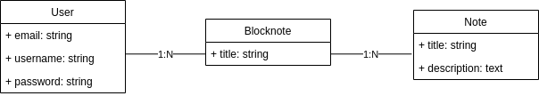

# Create An MVP With Phoenix Framework

## About

This repository is the base for a workshop about how to create an [MVP](https://en.wikipedia.org/wiki/Minimum_viable_product) with [Elixir](https://elixir-lang.org/) and [Phoenix Framework](https://phoenixframework.org/). In this workshop, we're going to tackle the development of a product idea, setting our development environment, seeing the structure of a regular [Phoenix](https://phoenixframework.org/) application, modeling the business logic, building the web and shipping the final result to production.

So... let's go!!!

## Contents

- [The Idea](#the-idea)
- [Environment Setup](#environment-setup)
  - [Natively](#natively)
  - [Version Manager](#version-manager)
  - [Docker](#docker)
- [Phoenix Application Structure](#phoenix-application-structure)
  - [Config Files](#config-files)
  - [Assets](#assets)
  - [Application Config](#application-config)
  - [Lib](#lib)
  - [Priv](#priv)
  - [Test](#test)
- [Modeling The Business Logic](#modeling-the-business-logic)
  - [Contexts](#contexts)
  - [Schemas](#schemas)
  - [Context Organization](#context-organization)
- [Building The Web](#building-the-web)
  - [Router](#router)
  - [Controllers](#controllers)
  - [Templates And Views](#templates-and-views)
- [Shipping To Production](#shipping-to-production)
  - [Distillery](#distillery)
  - [Heroku](#heroku)
  - [Other Alternatives](#other-alternatives)
- [Final Product](#final-product)
- [References](#references)
  - [Online Resources](#online-resources)
  - [Books](#books)

## The Idea

The product we want to create will be a simple application which with we can sync all our notes in the cloud. For the **MVP**, we just need to store the **user’s information**, a series of **blocknotes** created by the user, and the **notes** which belongs to the **blocknotes**. The models diagram will look pretty simple, something like this:

So once we have defined the product we're going to develop, and with the data modeling done, the first step we need to do is to setup our development environment.

## Environment Setup

We'll need to install the following dependencies:

* [Erlang](https://www.erlang.org/): a programming language used to build **massively scalable soft real-time systems** with requirements on **high availability**. Some of its uses are in **telecoms**, **banking**, **e-commerce**, **computer telephony** and **instant messaging**. Erlang's runtime system has built-in support for **concurrency**, **distribution** and **fault tolerance**.

* [Elixir](https://elixir-lang.org/): a dynamic, **functional language** designed for building **scalable and maintainable** applications. **Elixir** leverages the **Erlang VM**, known for running low-latency, distributed and fault-tolerant systems, while also being successfully used in web development and the embedded software domain.

* [Phoenix Framework](https://phoenixframework.org/): a productive web framework that **does not compromise speed and maintainability**.

* [Node.js](https://nodejs.org/): asynchronous event driven **JavaScript** runtime, designed to build **scalable network applications**.

* [PostgreSQL](https://www.postgresql.org/): a **powerful**, open source **object-relational database system** with over 30 years of active development that has earned it a strong reputation for **reliability**, **feature robustness**, and **performance**.

There're three main ways to install all this stuff: **by instaling all natively**, using a **version manager** to install it in our machine, or creating an isolated **Docker container** with all the dependencies.

### Natively

Erlang: erlang.org/doc/installation_guide/INSTALL.html

Elixir: elixir-lang.org/install.html

Phoenix Framework: hexdocs.pm/phoenix/installation.html

Node.js: nodejs.org/en/download/package-manager

PostgreSQL: postgresql.org/docs/current/static/tutorial-install.html

### Version Manager

asdf: Extendable version manager with support for Ruby, Node.js, Elixir Erlang & more.

github.com/asdf-vm/asdf

### Docker

We can recreate the setup of our servers to work in development in the same conditions.

Key files: Dockerfile and docker-compose.yml

docs.docker.com/install

github.com/dreamingechoes/docker-elixir-phoenix

## Phoenix Application Structure

### Config Files

We have a series of files in the root of the application:

mix.exs: main application configuration.

.formatter.exs: configuration for the mix format task.

.credo.exs: configuration for Credo.

### Assets

Folder with all the stuff related with the application’s assets:

Brunch config (brunch is used by default by Phoenix)

CSS

Javascript

Static files

### Application Config

Folder with all the definitions of the main application configuration, as well as the different environments:

config.exs

dev.exs

prod.exs

test.exs

### Lib

Contains the core of the application, both business logic and web implementation.

### Priv

Contains internationalization and database files:

gettext folder: internationalization files.

repo folder: migrations and database seeds.

### Test

All about application tests, both unit and integration.

## Modeling The Business Logic

Inside the LIB folder, we have a place in which we can define all the business logic of our application.

Contexts: hexdocs.pm/phoenix/contexts.html

Schemas: hexdocs.pm/ecto/Ecto.Schema.html

application.ex: hexdocs.pm/elixir/Application.html

repo.ex

### Contexts

### Schemas

### Context Organization

## Building The Web

Inside the LIB folder, we have a place in which we can develop the final web which with will interact the final user.

Controllers: hexdocs.pm/phoenix/controllers.html

Templates: hexdocs.pm/phoenix/templates.html

Views: hexdocs.pm/phoenix/views.html

router.ex: hexdocs.pm/phoenix/Phoenix.Router.html

### Router

### Controllers

### Templates And Views

## Shipping To Production

### Distillery

Simplify deployments in Elixir. This is useful if we have a server and we want to deploy our application in there.

Distillery will compile the application with the specified configuration, generate the binaries and push it to our server.

github.com/bitwalker/distillery

### Heroku

Heroku provides great integration with Phoenix applications, with buildpacks specifically designed for Elixir projects.

It’s the best method to start a MVP. Free server, free database storage, zero server configuration.

heroku.com

### Other Alternatives

Amazon AWS: aws.amazon.com

Google Cloud: cloud.google.com

Gigalixir: gigalixir.com

## Final Product

## References

### Online Resources

### Books

----------------------------

This project was developed by [dreamingechoes](https://github.com/dreamingechoes).
It adheres to its [code of conduct](https://github.com/dreamingechoes/base/blob/master/files/CODE_OF_CONDUCT.md) and
[contributing guidelines](https://github.com/dreamingechoes/base/blob/master/files/CONTRIBUTING.md), and uses an equivalent [license](https://github.com/dreamingechoes/base/blob/master/files/LICENSE).
