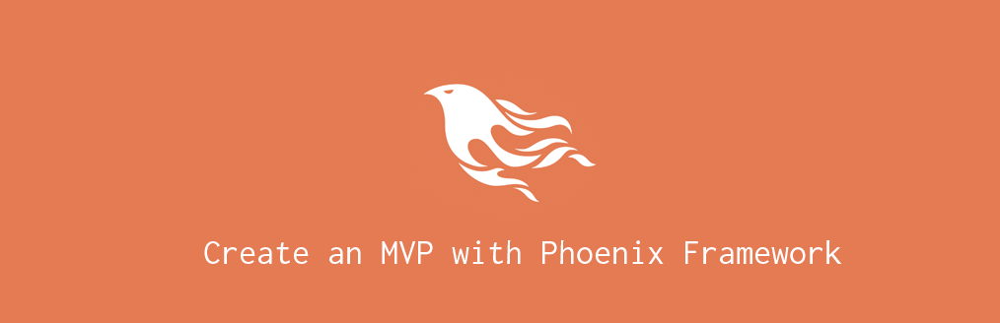

# Create An MVP With Phoenix Framework

## About

## Contents

- [The Idea](#the-idea)
- [Environment Setup](#environment-setup)
  - [Natively](#natively)
  - [Version Manager](#version-manager)
  - [Docker](#docker)
- [Phoenix Application Structure](#phoenix-application-structure)
  - [Config Files](#config-files)
  - [Assets](#assets)
  - [Application Config](#application-config)
  - [Lib](#lib)
  - [Priv](#priv)
  - [Test](#test)
- [Modeling The Logic](#modeling-the-logic)
  - [Contexts](#contexts)
  - [Schemas](#schemas)
  - [Context Organization](#context-organization)
- [Building The Web](#building-the-web)
  - [Router](#router)
  - [Controllers](#controllers)
  - [Templates And Views](#templates-and-views)
- [Shipping To Production](#shipping-to-production)
  - [Distillery](#distillery)
  - [Heroku](#heroku)
  - [Other Alternatives](#other-alternatives)
- [Final Product](#final-product)
- [References](#references)
  - [Online Resources](#online-resources)
  - [Books](#books)

## The Idea

## Environment Setup

### Natively

### Version Manager

### Docker

## Phoenix Application Structure

### Config Files

### Assets

### Application Config

### Lib

### Priv

### Test

## Modeling The Logic

### Contexts

### Schemas

### Context Organization

## Building The Web

### Router

### Controllers

### Templates And Views

## Shipping To Production

### Distillery

### Heroku

### Other Alternatives

## Final Product

## References

### Online Resources

### Books

----------------------------

This project was developed by [dreamingechoes](https://github.com/dreamingechoes).
It adheres to its [code of conduct](https://github.com/dreamingechoes/base/blob/master/files/CODE_OF_CONDUCT.md) and
[contributing guidelines](https://github.com/dreamingechoes/base/blob/master/files/CONTRIBUTING.md), and uses an equivalent [license](https://github.com/dreamingechoes/base/blob/master/files/LICENSE).
