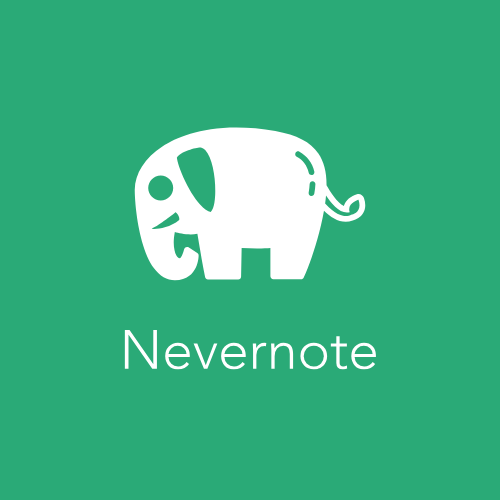

# Nevenote

## About

Application to create blocknotes with your ideas. A revolutionary application never done before :joy:

## Setup development environment with Docker

This project is Docker friendly from day one. To start working on it:

* Setup the web container with `docker-compose build web`.
* Install dependencies with `docker-compose run web mix deps.get`.
* Create your database with `docker-compose run web mix ecto.setup`.
* Install Node.js dependencies with `docker-compose run web bash -c "cd assets; npm install"`.
* Start the application with `docker-compose up`.

## Setup testing environment with Docker

This step assumes you already followed instructions from previous paragraph.

* Create your testing database with `docker-compose run web env MIX_ENV=test mix ecto.create`.
* Migrate your testing database with `docker-compose run web env MIX_ENV=test mix ecto.migrate`.
* Run the test suite with `docker-compose run web env MIX_ENV=test mix test`.
* Run the test suite with coverage report on `cover` folder with: `docker-compose run web env MIX_ENV=test mix coveralls.html`.

----------------------------

This project was developed by [dreamingechoes](https://github.com/dreamingechoes).
It adheres to its [code of conduct](https://github.com/dreamingechoes/base/blob/master/files/CODE_OF_CONDUCT.md) and
[contributing guidelines](https://github.com/dreamingechoes/base/blob/master/files/CONTRIBUTING.md), and uses an equivalent [license](https://github.com/dreamingechoes/base/blob/master/files/LICENSE).
